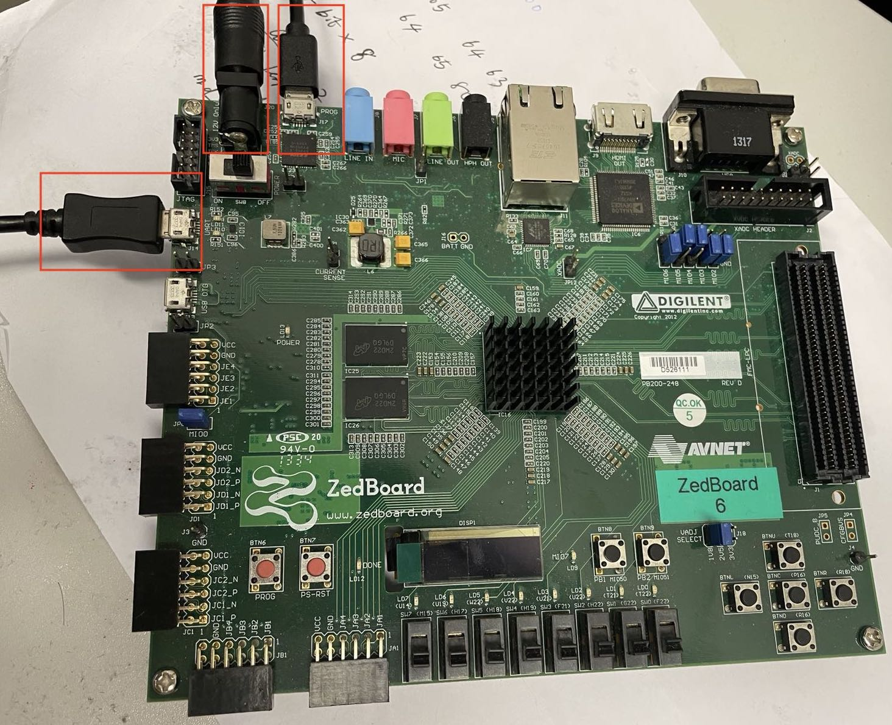
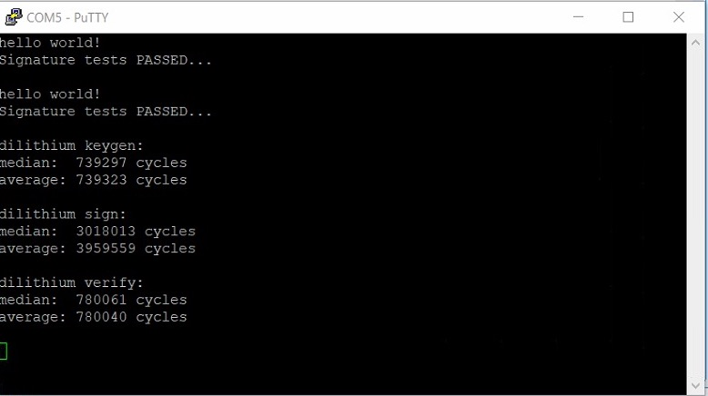

# SW/HW Co-Design Implementation

Tool: Xilinx Vitis 2020.2 and PuTTY.

FPGA device: Xilinx ZedBoard.

## Create and Build Application Project

1. Open Vitis by selecting **File->New->Application Project**, select **Create a new platform from hardware**, and select the generated .xsa file. 
2. Choose the template **Empty Application**, and click Finish. Now the application project is created.
3. In the **Explorer -> Src**, double click the **Iscript.ld**, set the **Stack Size** and **Heap Size** 0xFF000. Then save the setting.
4. Right click **src**, select **Import Sources**, import from directory, select the directory (e.g. `Code/SW-HW-Co-design/Overall-design/Cache_ON/Dililithium-2`). Now the application files are imported.
5. In **Explorer**, right-click the **_system [design_1 wrapper] -> build project**. Now the application project is successfully built.

- Remark: for other application files contained in `Code/SW_benchmark` and `Code/SW-HW-Co-design`, the project build process is the same.

## Real Board Testing

1. Connect the power of ZedBoard. Connect the host PC and ZedBoard with the USB-JTAG and USB-UART ports. The board connection is shown below.

   

2. Open the **Device Manager -> Ports**, and find the COM number of the USB Serial Device (e.g., COM 5). 

3. Open the PuTTY, Choose the connection type **Serial**, and set the serial port (e.g., COM 5) and the speed **115200**. Click **Open**. Now you can see the serial communication window.

4. Go back to the built Vitis project, click **Run As -> Launch on Hardware**, then the application running information is printed in the serial communication window. An example result is shown below.

