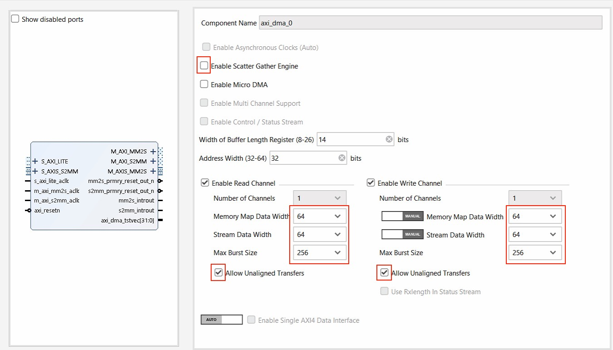
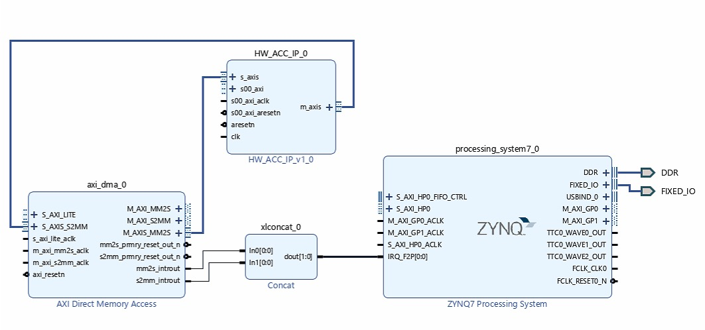

# Hardware implementation

Tool: Xilinx Vivado 2020.2.

## Hardware Accelerator IP Generation

1. Open Vivado by selecting **File->Project->New**. Select a project location, and create an **RTL project**.
2. In the **Add Sources** window, click **Add Files**, add all the files contained in `Code/HW/sources/` (including files in  `ip/`, `NTT source/`, `PWM_source/`, `SHA_source/`, `Top_control/`), choose **Scan and add RTL include files into project** and **Copy files into project**, click **Next**.
3. In the **Add constraints** window, add the .xdc file in `Code/HW/constrs/`,  and click **Next**.
4. Select ZedBoard,  click **Next**, and click **Finish**. Now the project is created.
5. In the **Sources->Coefficient Files**, remove the red **zetas.COE** files. Go to **Sources->Design sources->HW_ACC_IP->HW_module->NTT_Top**. Double click **zetas_mem**, in Other options, load the memory initialization file in `Code/HW/zetas.COE`, click the **OK** then **Generate**.
6. Click **Run Synthesis**, and make sure Synthesis is completed. (This step is not required, it is only used to check the files are added correctly.)
7. Click **Tools->Create and Package New IP**, click **Package your current project**, select an IP location, and click **Finish**. In the **Package IP->Review and Package**, click the **Package IP**. Now the IP file component.xml is generated. We provide the generated .xml file in `Gen_HW_file/component.xml`. 

## Hardware Bitstream Generation

1. Open Vivado, and create a new project without adding any source files. Select ZedBoard.

2. Click **PROJECT MANAGER -> Project Settings -> IP -> Repository -> ''+"**, add the IP Repository, which contains the component.xml file. Now the HW_ACC_IP_v1_0 has been added.

3. Click **Create Block Design**, add the **zynq** processing system, and click **Run Block Automation**. Then double click the ZYNQ Processing System, click **Presets -> Apply Configuration**,  select the configuration file in `Code/HW/PS_preset.tcl`.

4.  Add **AXI Direct Memory Access** IP, configure DMA as below.

   

5. Add the **Concat** IP and the **HW_ACC_IP**.

6. Connect the added IPs as below.

7. Click **Run Connection Automation** and **All Automation**. Then repeat one more connection process. 

8. Regenerate the layout and click **Valid Design**. The system diagram is shown below.

9. In the Sources->Design Sources, click **Generate Output Product** and **Create HDL Wrapper**.

10. Click **Generate Bitstream**. When write_bitstream completed,  click **File -> Export -> Export Hardware**, include bitstream, export the XSA file. Now the design_1_wrapper.xsa file is generated. We provide the generated .xsa file in `Gen_HW_file/design_1_wrapper.xsa`. 

